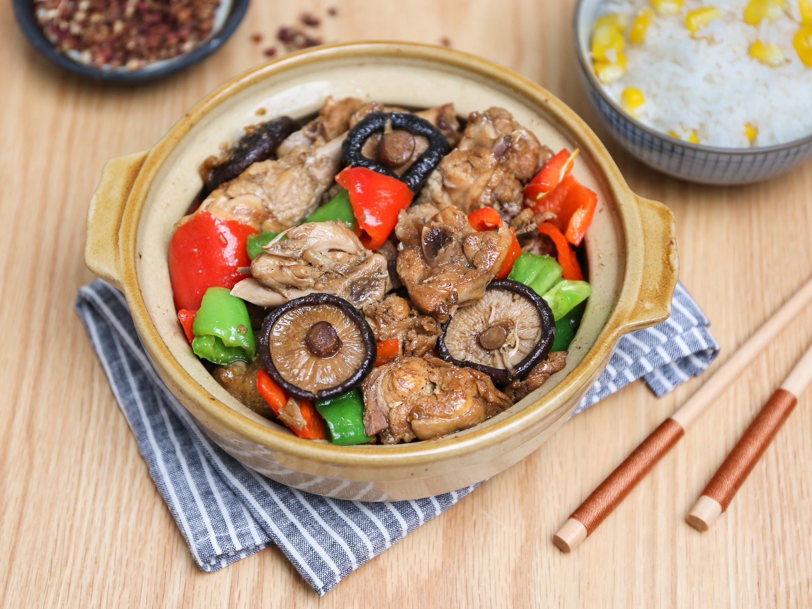
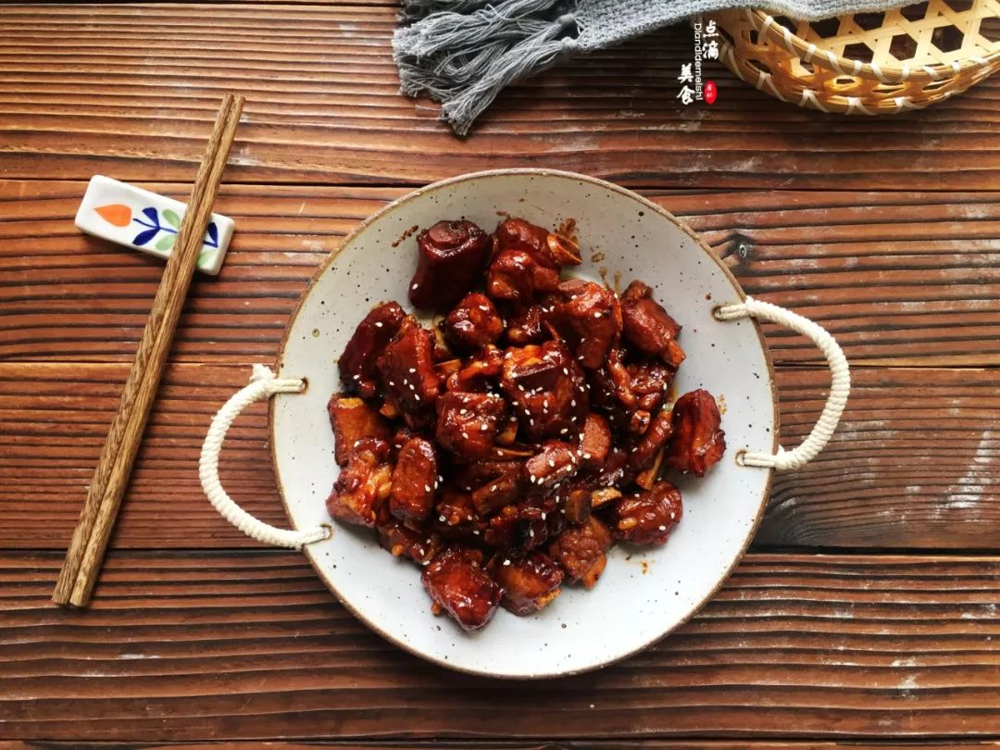
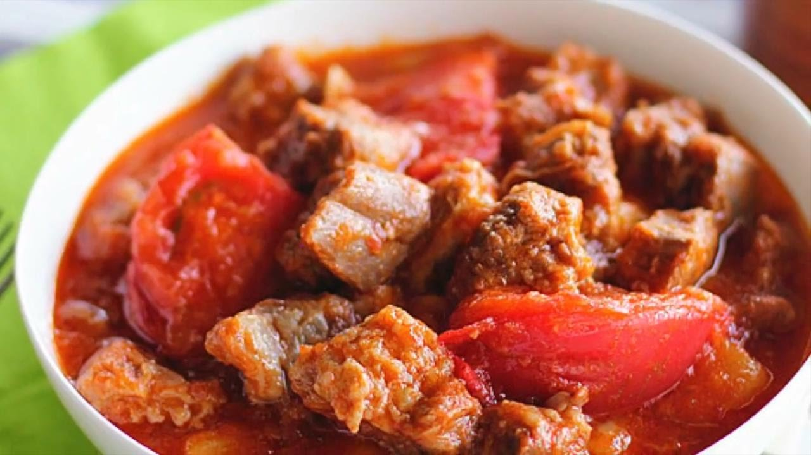
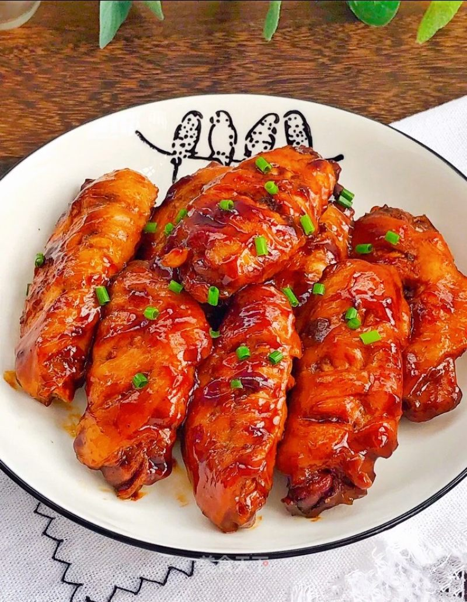
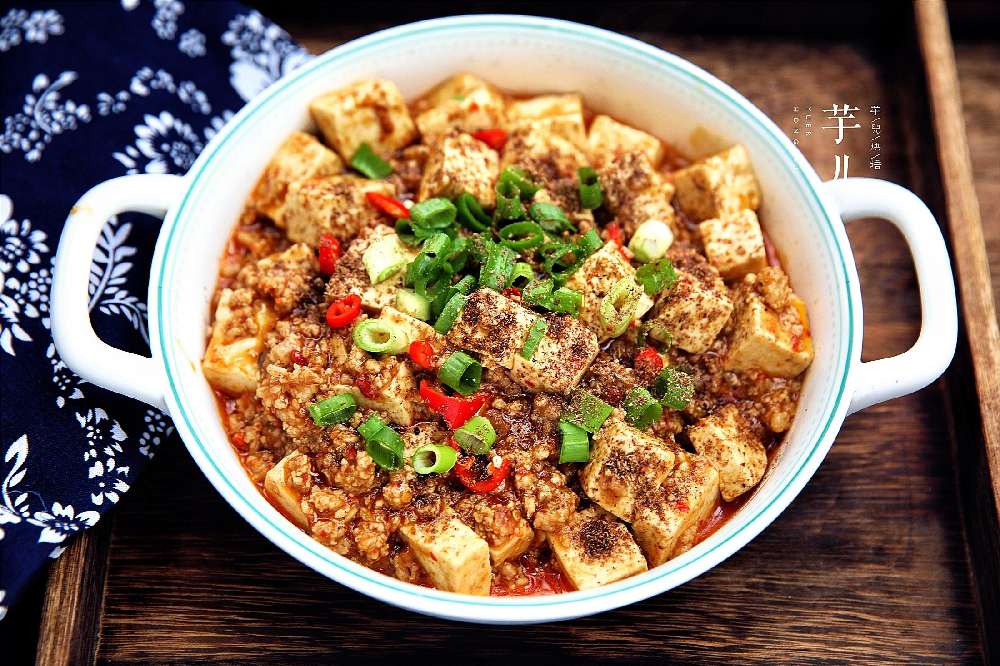
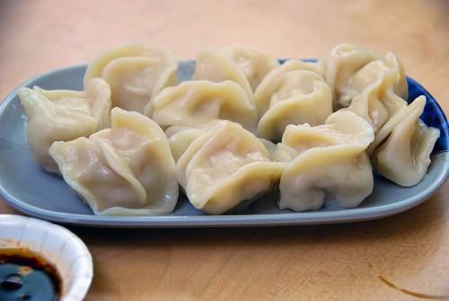
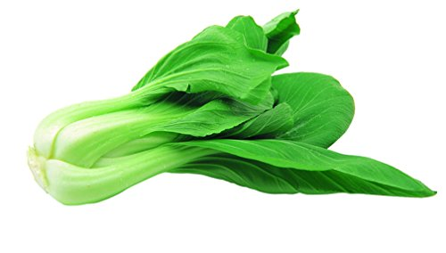
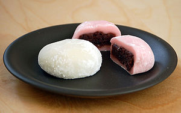

## goody-eaty
My Menu at 80807 SCHWABING-MUNICH -- Version 0.1 powered by my virtue
### Description
It is a user guide for how to make life fantastic
(ok, it is about the possible dishes THE Chinese Guy gonna prepare and to show you guys in advance what possible shaddy stuff can be in it.)
**Possible dish-selection within my cooking abilities.**

!!attenzione: The following picture is the most ideal case.  The chef have the right of interpretations of final dishes! grazie!

### For meatarian 
* 黄焖鸡(Huang Men Ji)       Soya-marinade chicken with Chinese champignon and potatoes. (salty and sweet)

* 红烧排骨(Hong Shao Pai Gu)  Pork chops(ribs) in brown sauce(Chinese Style) or in Korean sweet chilli paste with sesame (Korean Style)

* 番茄牛腩(Fan Qie Niu Nan)  Stewed Beef-Gluash with tomato and onion (salty, sour and sweet, similar to the taste of Russia borsch)

* 可乐鸡翅（Ke Le Ji Chi）    Cola chicken-wings （sweet）

* 麻婆豆腐 （Ma Po Toufu）    Spicy or (unspicy) tofu with soyabean Sauce and minced pork (spicy or unspicy and salty)

* 猪肉饺子 （Zhu Rou Jiao Zi） The real chinese dumplings with chopped pork as filling

---Backup Special dishes---depending on the chefs mood
* 孜然羊肉 （Zi Ran Yang Rou）Stewd-fried mutton in cumin flavour

### For vegetarian
* 清炒白菜(Qing Chao Pak Choi) Stir-Fried Green Vegetables （Pak Choi）

* 日式蔬菜沙拉（Ri Shi Shu Cai Sha La） Japanese Vegetable salad (lettuce, radish, unspicy pepper) with sesame and wasabi mixed sause 

### For seafood enthusiasts (ME, for example)
* 白酒淡菜 Mussel in White-Wine and gringer
* 红烧或番茄虾 Shrimps in brown sauce or in tomaten sause
* 

### Dessert
* 麻薯 （Moji） Rice-Cake with red-bean paste

