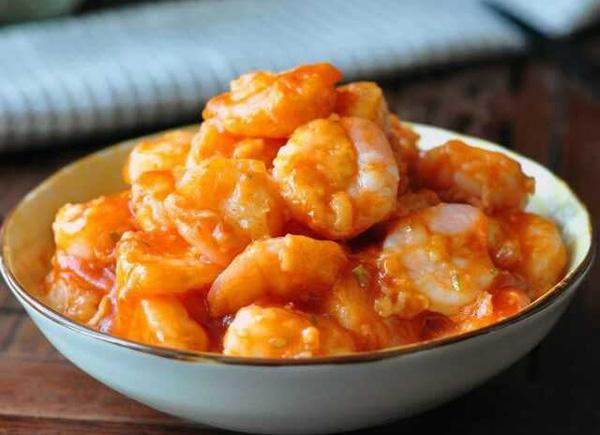

## goody-eaty

>My first GitHub README file
---
My Menu at 80807 SCHWABING-MUNICH -- Version 0.1 powered by my internal peace and love
### Description
It is a user guide for how to make our christmas party fantastic
(ok, it is nothing but a menu about the possible dishes that THE Chinese Guy gonna prepare and show you guys in advance what possible shaddy stuff can be inside.)

### What you gonna do
The following dishes are possible dish-selection within my cooking abilities. Only a few dishes will be selected in the final around. Write dish-numbers in the [Issue](https://github.com/marcomeng1/goody-eaty/issues) that you prefer, although I decide finally on dishes. Come on, stop yelling. It is just the life and you have to admit it, just same as the demoracy in my country.

**!!attenzione: The following pictures are just beutifully showed in a most ideal case. The chef has the final right of interpretations of all cooked dishes! grazie!**

### For meatarian 
* No.1 黄焖鸡(Huang Men Ji)       Soya-marinade chicken with Chinese champignon, peppers and potatoes. (salty and sweet)

* No.2 红烧排骨(Hong Shao Pai Gu)  Pork chops(ribs) in brown sauce(Chinese Style) or in Korean sweet chilli paste with sesame (Korean Style)

* No.3 番茄牛腩(Fan Qie Niu Nan)  Stewed Beef-gulasch with tomato and onion (salty, sour and sweet, similar to the taste of Russia borsch)

* No.4 可乐鸡翅（Ke Le Ji Chi）    Cola chicken-wings （sweet）

* No.5 麻婆豆腐 （Ma Po Toufu）    Spicy or (unspicy) tofu with soyabean sauce and minced pork (spicy or unspicy and salty)

* No.6 猪肉饺子 （Zhu Rou Jiao Zi） The real chinese dumplings with chopped pork as filling

---Backup Special dishes---depending on the chefs mood
* No.7 孜然羊肉 （Zi Ran Yang Rou）Stewd-fried mutton in cumin flavour

### For vegetarian
* No.8 清炒白菜(Qing Chao Pak Choi) Stir-fried green vegetables （Pak Choi）

* No.9 日式蔬菜沙拉（Ri Shi Shu Cai Sha La） Japanese vegetable salad (lettuce, radish, unspicy pepper) with sesame and wasabi mixed sause 

### For seafood enthusiasts
* No.10 白酒淡菜 Mussel in white-wine and ginger

* No.11 红烧或番茄虾 Shrimps in brown sauce or in tomato sause

### Dessert
* No.12 麻薯 （Moji） Rice-cake with red-bean paste
---

### Sonstig
* Colombian Arepas (if I have time to prepare them :D)
